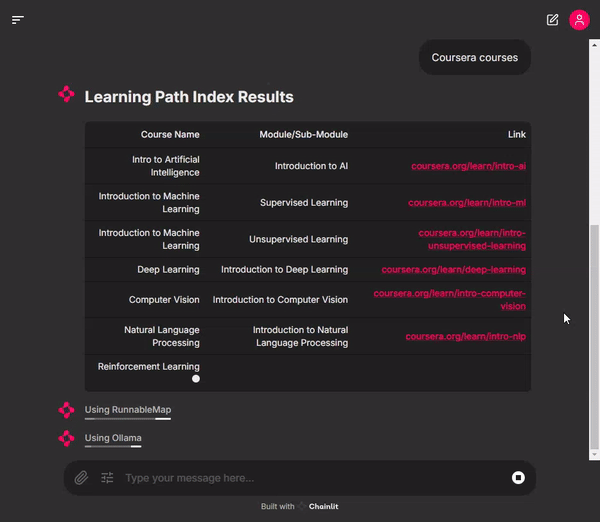

 # Deployment: Infrastructure as Code

The scripts in this folder give the ability to provision and manage compute capacity using [Google Cloud Platform](https://cloud.google.com/), in order to deploy the LLM Application and provision the Chainlit app.

In short, the scripts do the following:
- Create compute instances and associated network resources necessary to run an instance on GCP
- Create the necessary firewall configurations to allow services to communicate publicly over HTTP and HTTPS
- Set up an [Ollama](https://github.com/ollama/ollama) service on the Compute instance, and start it
- Finally, start the Chainlit app, and expose it on port 8000. The interface will be accessible on `<compute-instance-public-IP>:8000`



**Table of Contents**
- [Pre-requisites](#pre-requisites)
- [Provisioning Infrastructure using Terraform](#provisioning-infrastructure-using-terraform)
  - [Create a new project on Google Console](#create-a-new-project-on-google-console)
  - [Authenticate Terraform with GCloud credentials](#authenticate-terraform-with-gcloud-credentials)
  - [Create Cloud Bucket to store Terraform state](#create-cloud-bucket-to-store-terraform-state)
  - [Deploy with Terraform](#deploy-with-terraform)
  - [Destroy infrastructure (cleanup)](#destroy-infrastructure-cleanup)
- [Security](#security)

## Pre-requisites

- A Google Console account with some credits. [If it's a new GCP account, you might get access to free $300 credits](https://cloud.google.com/free?hl=en)
- Install GCloud CLI. See [the official GCloud installation guide](https://cloud.google.com/sdk/docs/install).
- [Install Terraform](https://learn.hashicorp.com/terraform/getting-started/install.html) (all operating systems are supported)
- Clone this repository

```bash
git clone https://github.com/neomatrix369/learning-path-index/
cd learning-path-index
cd app/llm-poc-variant-01/deploy/gcp
```

For a summary (also helps to verify the steps) of the above steps please see [here](https://registry.terraform.io/providers/hashicorp/google/latest/docs).

### Quick Terraform install script for Linux

```bash
curl -sSL https://releases.hashicorp.com/terraform/1.9.8/terraform_1.9.8_linux_386.zip -o ~/terraform_1.9.8_linux_386.zip

unzip -q ~/terraform_1.9.8_linux_386.zip -d /tmp/terraform_1.9.8_linux_386
mv /tmp/terraform_1.9.8_linux_386/terraform /usr/local/bin/terraform

rm -rf /tmp/terraform_1.9.8_linux_386/
```


## Provisioning Infrastructure using Terraform
- #### Create a new project on Google Console.
  In your terminal, in the LPI repository folder, run:
  ```bash
  gcloud config set project <PROJECT_ID>
  ```

- #### Authenticate Terraform with GCloud credentials
  This workflow assumes you are working on a personal computer/workstation. For CI/CD pipelines, [other authentication steps are recommended](https://cloud.google.com/docs/terraform)
  ```bash
  gcloud auth application-default login
  ```

- #### Create Cloud Bucket to store Terraform state
  ```bash
  gsutil mb -l europe-west1 gs://llm-project-sbx-tf-state

  gsutil versioning set on gs://llm-project-sbx-tf-state
  ```

  Substitute `europe-west1` for [any other region of your choice](https://cloud.google.com/compute/docs/regions-zones).

- #### Deploy with terraform

  ```bash
  terraform init

  terraform workspace new llm-project

  terraform apply --auto-approve
  ```

  The deployment process should end with a list of private/public ip addresses like so:

  ```bash
  Apply complete! Resources: 1 added, 0 changed, 0 destroyed.

  Outputs:

  network_interface_0_access_config_0_nat_ip = "<REDACTED>"
  network_interface_0_network_ip = "<REDACTED>"
  self_link = "<REDACTED>"
  tags = toset([
    "http-server",
    "https-server",
    "lpi-sg",
  ])
  ```

  The public IP addresses are fairly dynamic in nature and could be between any range (example shown above). Please make a note of the Public IP above as it will be needed in the following steps.

- #### SSH into the Compute Instance
The compute instance can be accessed over SSH viz:
```bash
gcloud compute ssh --project=<PROJECT_ID> --zone=<PROJECT_GCP_ZONE> lpi-cpu-vm
```

### Destroy infrastructure (cleanup)

- Remove resources or destroy them with terraform

```bash
$ terraform destroy --var-file=project.tfvars --auto-approve
```

You should see something like this at the end of a successful run:

```text
.
.
.
Destroy complete! Resources: 7 destroyed.
```

### Security

Note that this setup does not take into account establishing a secure `http` i.e. `https` communication between the Chainlit instance and the browser, nor does it place emphasis on creating a fool-proof firewall for the compute instance. Please beware when using this in your target domain depending on the prerequisites you need to conform to. This example is good for learning and illustration purposes, please do NOT deploy it in production or public facing environments.
